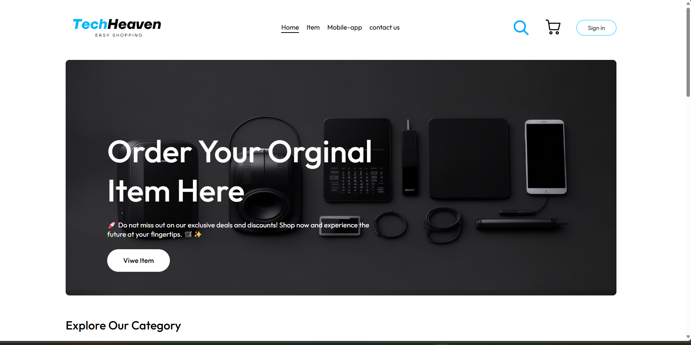
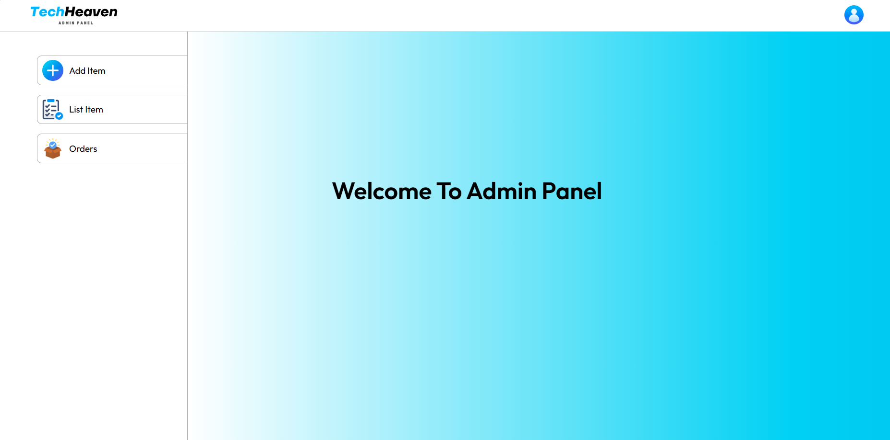

# TechHaven E-Commerce Website


Welcome to **TechHaven**, your one-stop shop for the latest and greatest in tech products. This platform is built with a modern stack to provide a seamless shopping experience and a robust management interface.

## 🔗 Live Links
* **Main Web Store:** [View TechHaven Live](https://techhaventcommerce.udayangakasun696.workers.dev/)
* **Admin Dashboard:** [Access Admin Panel](https://techhavenommerce.udayangakasun696.workers.dev/)

---

## Table of Contents
- [Introduction](#introduction)
- [Features](#features)
- [Project Documentation](#project-documentation)
- [Technologies Used](#technologies-used)
- [Installation](#installation)
- [Usage](#usage)
- [Contributing](#contributing)
- [License](#license)

## Introduction
TechHaven is a fully-featured e-commerce platform where users can browse and purchase a wide range of tech products. The platform includes a user-friendly frontend for customers, a high-performance backend, and an intuitive admin panel for store management.

## Features
* **Product Catalog:** Dynamic product browsing with detailed views.
* **Shopping Cart:** Real-time cart management and secure checkout.
* **Order Management:** Track and manage user orders.
* **Admin Dashboard:** Full control over products, orders, and user data.
* **Secure Payments:** Integration with Stripe for safe transactions.

## Project Documentation
| Document | Link |
| :--- | :--- |
| **SRS Document** | [View PDF](TechHeaven/assets/SRSTechHeaven.pdf) |
| **Project Proposal** | [View PDF](TechHeaven/assets/ProjectProposal.pdf) |

---

## Technologies Used
* **Frontend:** HTML, CSS, JavaScript, React.js + Vite
* **Backend:** Node.js, Express.js
* **Database:** MongoDB
* **Authentication:** JWT (JSON Web Tokens)
* **Payments:** Stripe API

---

## Installation

To set up the project locally, follow these steps:

1.  **Clone the repository:**
    ```sh
    git clone [https://github.com/KasunUdayanga/TechHaven.git](https://github.com/KasunUdayanga/TechHaven.git)
    cd TechHaven
    ```

2.  **Install dependencies for all modules:**
    ```sh
    # Frontend
    cd frontend && npm install
    
    # Backend
    cd ../backend && npm install

    # Admin Panel
    cd ../admin && npm install
    ```

3.  **Set up environment variables:**
    Create a `.env` file in the **backend** directory and add:
    ```env
    JWT_SECRET="your_random_secret_here"
    STRIPE_SECRET_KEY="your_stripe_key_here"
    MONGO_URI="your_mongodb_connection_string"
    ```

4.  **Start the development servers:**
    * **Backend:** `cd backend && npm run server`
    * **Frontend:** `cd frontend && npm run dev`
    * **Admin Panel:** `cd admin && npm run dev`

---

## Usage

### Frontend
The customer portal is designed for speed and ease of use. It handles everything from product discovery to final payment.



### Admin Panel
The admin dashboard allows staff to update inventory, monitor sales, and manage the user base efficiently.



---

## Contributing
We welcome contributions to enhance the TechHaven platform!

1.  Fork the repository.
2.  Create a new branch (`git checkout -b feature/your-feature-name`).
3.  Commit your changes (`git commit -m 'Add some feature'`).
4.  Push to the branch (`git push origin feature/your-feature-name`).
5.  Open a pull request.

## License
This project is licensed under the **ISC License**. See the [LICENSE](LICENSE) file for details.